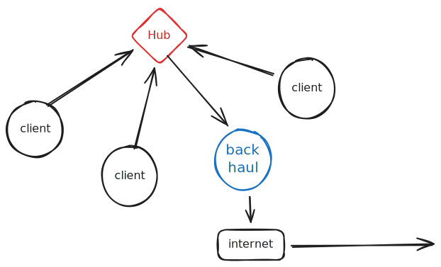
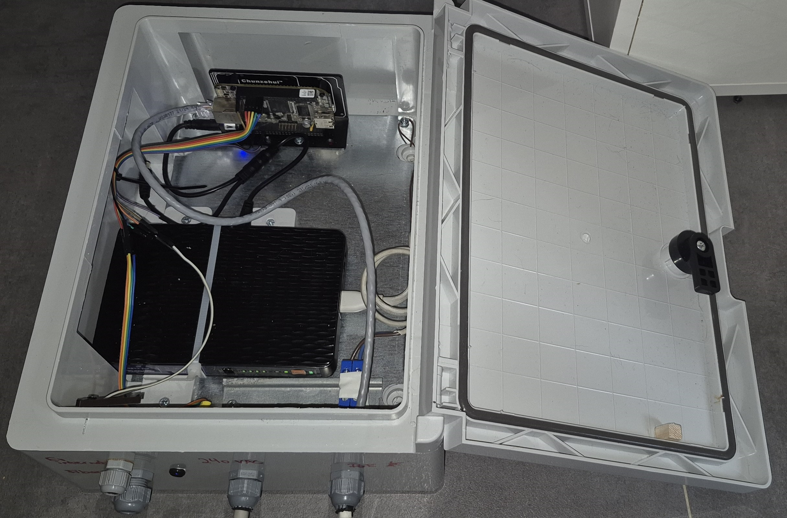
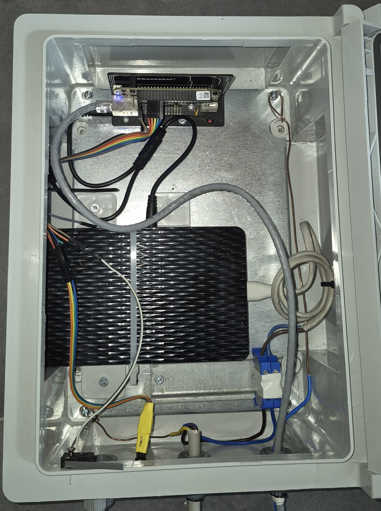
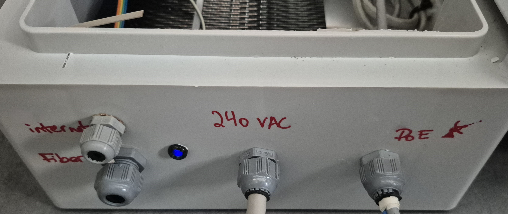
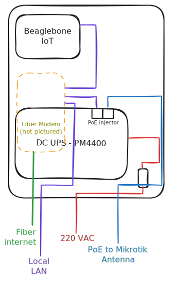

# beaglebone-iot

IoT beaglebone services running at device boxes in the field.

This project is the code repository for the IoT devices embedded with the remote stations in a non-commercial wisp deployment. The wisp network layout is a hub and spoke layout where multiple 5GHz wireless devices are connected to a central sector antenna, and internet backhaul is done via a fiber optic internet uplink.

## Physical layout

The IoT is housed in the junction box which serves to power the hubs.

## I/O Connections

The Beaglebone is connected via ribbon cable to 6 I/O connections as well as 3.3VDC and GND for a total of 8 wires.

The wires are:

| gpio name | header | index | color  | Application Usage |
|-----------|--------|-------|--------|-------------------|
| DGND      | P8     | 2     | gray   | -                 |
| 3.3VDC    | P9     | 4     | black  | -                 |
| SYS_RST   | P9     | 10    | purple | system reset      |
| P8_8      | P8     | 8     | red    | Red LED           |
| P8_10     | P8     | 10    | orange | Door switch       |
| P8_12     | P8     | 12    | yellow | Green LED         |
| P8_14     | P8     | 14    | green  | 220VAC sensor     |
| P8_16     | P8     | 16    | blue   | Blue LED          |

## System Software

### Beaglebone image

Stock standard [debian trixxie image](https://files.beagle.cc/file/beagleboard-public-2021/images/am335x-debian-13.2-base-v6.18-armhf-2025-12-08-4gb.img.xz) adapted for beaglebone black.

### systemd

`systemd` is used for lifecycle control. There is one service called `monitor`.

## Software

`/usr/local/bin/monitor.sh` is the script containing all the monitoring.

## Functions
